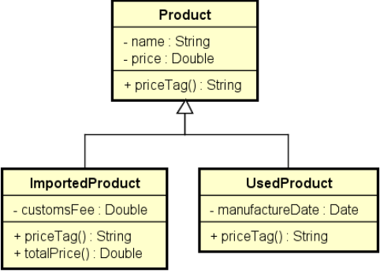

# Inheritance and Polymorphism in C#

#### This exercise is based on the <a href="https://www.udemy.com/course/programacao-orientada-a-objetos-csharp/?couponCode=MT260714G2">"C# COMPLETO Programação Orientada a Objetos + Projetos"</a> course.

### <ins>Upcasting and Downcasting</ins>

#### Upcasting
- Casting from subclass to superclass
- Common use: polymorphism

#### Downcasting
- Casting from superclass to subclass
- `as` keyword
- `is` keyword
- Common use: methods accepting generic parameters (ex: Equals)

### <ins>Override, Base and Virtual keywords</ins>

#### Override Method

- It is the implementation of a superclass method in the subclass.
- For a regular (non-abstract) method to be overridden, it must be declared with the `virtual` keyword.
- When overriding a method, the `override` keyword must be used.

#### Example:

#### Suppose the following withdrawal rules:

- Checking account: a fee of 5.00 is charged.
- Savings account: no fee is charged.

#### How can this be solved? A: by overriding the withdraw method in the SavingsAccount subclass.

#### base Keyword

#### It is possible to call the superclass implementation using the base keyword.

#### For example, suppose the withdrawal rule for a savings account is to perform the withdrawal normally using the superclass (Account) implementation, and then deduct an additional 2.0.

### <ins>Exercise01 - Polymorphism</ins>

#### A company has both regular and outsourced employees.

#### For each employee, the company wants to record their name, hours worked, and hourly rate. Outsourced employees also have an additional expense.

#### Employee payment is calculated as the hourly rate multiplied by the hours worked. Outsourced employees also receive a bonus corresponding to 110% of their additional expense.

#### Write a program to read the data for N employees (N provided by the user) and store them in a list. After reading all the data, display the name and payment of each employee in the same order in which they were entered.

#### Example:

Enter the number of employees: <strong>3</strong> 
Employee #1 data: 
Outsourced (y/n)? <strong>n</strong> 
Name: <strong>Alex</strong> 
Hours: <strong>50</strong> 
Value per hour: <strong>20.00</strong> 
Employee #2 data: 
Outsourced (y/n)? <strong>y</strong> 
Name: <strong>Bob</strong> 
Hours: <strong>100</strong> 
Value per hour: <strong>15.00</strong> 
Additional charge: <strong>200.00</strong> 
Employee #3 data: 
Outsourced (y/n)? <strong>n</strong> 
Name: <strong>Maria</strong> 
Hours: <strong>60</strong> 
Value per hour: <strong>20.00</strong>

PAYMENTS: 
Alex - $1000.00$ 
Bob - $1720.00$ 
Maria - $1200.00$

### <ins>Exercise02 - Polymorphism</ins>

#### Write a program to read the data for N products (N provided by the user). At the end, display the price tag for each product in the same order in which they were entered.

#### Every product has a name and a price. Imported products have a customs fee, while used products have a manufacturing date.

#### These specific data must be added to the price tag as shown in the example. For imported products, the customs fee must be added to the product's final price.

#### Please implement the program according to the design shown on the side.

#### Example:

Enter the number of products: <strong>3</strong> 
Product #1 data: 
Common, used or imported (c/u/i)? <strong>i</strong> 
Name: <strong>Tablet</strong> 
Price: <strong>260.00</strong> 
Customs fee: <strong>20.00</strong> 
Product #2 data: 
Common, used or imported (c/u/i)? <strong>c</strong> 
Name: <strong>Notebook</strong> 
Price: <strong>1100.00</strong> 
Product #3 data: 
Common, used or imported (c/u/i)? <strong>u</strong> 
Name: <strong>Iphone</strong> 
Price: <strong>400.00</strong> 
Manufacture date (DD/MM/YYYY): <strong>15/03/2017</strong> 

PRICE TAGS: 
Tablet  $280.00 (Customs fee: $20.00) 
Notebook $1100.00 
Iphone (used) $400.00 (Manufacture date: 15/03/2017)

### <ins>Exercise03 - Abstract Methods</ins>

#### Write a program that reads the data of N shapes (where N is provided by the user) and then displays the areas of these shapes in the same order in which they were entered.

#### Example:

Enter the number of shapes: <strong>2</strong> 
Shape #1 data: 
Rectangle or Circle (r/c)? <strong>r</strong> 
Color (Black/Blue/Red): <strong>Black</strong> 
Width: <strong>4.0</strong> 
Height: <strong>5.0</strong> 
Shape #2 data: 
Rectangle or Circle (r/c)? <strong>c</strong> 
Color (Black/Blue/Red): <strong>Red</strong> 
Radius: <strong>3.0</strong> 

SHAPE AREAS: 
20.00 
28.27